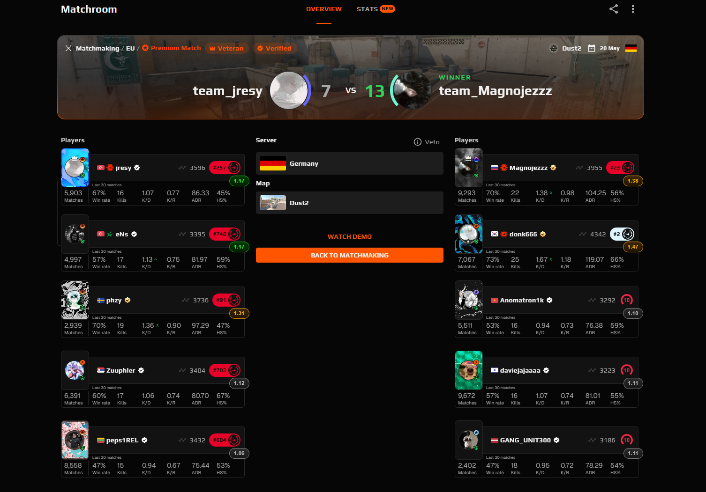

# FACEIT Rating Badge

A simple Chrome extension that displays FACEIT Season 8 Rating badges on player cards in matchrooms.
**THIS EXTENSION LOOKS AND WORKS BEST COMBINED WITH REPEEK ADVANCED MATCHROOM STATS!!!**



## What it does

Adds a small color-coded pill badge to every player card in a FACEIT matchroom, showing their average FACEIT Rating over the last 30 matches. I reajusted the rating ranges to make it easier to distinguish the best and worst players in lobbies.

| Badge | Rating | Meaning |
|-------|--------|---------|
| 🔴 Red | < 0.90 | Poor |
| ⚫ Gray | 0.90 – 1.14 | Okay |
| 🟢 Green | 1.15 – 1.24 | Good |
| 🟡 Yellow | 1.25+ | High Impact |

Hover over any badge to see the tier label.

---

## Installation

This extension is not yet on the Chrome Web Store, so you need to load it manually. It takes about 2 minutes.

### Step 1 — Get a FACEIT API key

1. Go to [developers.faceit.com](https://developers.faceit.com) and sign in with your FACEIT account. You need to have your email verified and 2FA enabled to do so.
2. Navigate to **App Studio** and click **New**
3. Fill in any name (e.g. `RatingBadge`) and use `https://example.com` as the App URL
4. Once created, go to the **API Keys** tab and copy your key

### Step 2 — Add your API key to the extension

1. Download or clone this repository
2. Open `content.js` in any text editor
3. On line 1, replace `YOUR_API_KEY` with your key:
   ```js
   const API_KEY = "your-actual-key-here";
   ```
4. Save the file

### Step 3 — Load the extension in Chrome

1. Open Chrome and go to `chrome://extensions`
2. Enable **Developer mode** using the toggle in the top right
3. Click **Load unpacked**
4. Select the folder containing the extension files
5. The extension is now active

### Step 4 — Use it

Open any FACEIT matchroom. Badges will appear on each player card within a few seconds, loading one by one to avoid rate limiting.

---

## Updating

If you download a new version, just replace the files in your extension folder and click the refresh icon on the extension card at `chrome://extensions`.

## Built with

- Vanilla JavaScript (no frameworks or dependencies)
- [FACEIT Data API v4](https://developers.faceit.com/docs/apis/data)
